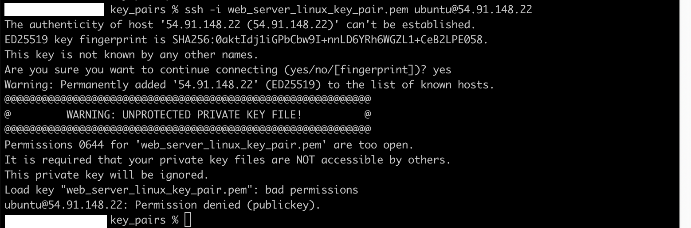

# **Day 8: DevOps Zero to Hero - Shell Scripting Project Using GitHub API Integration**

---

## **Introduction**
- **Topic Overview:**
  - Real-time DevOps project using shell scripting for GitHub API integration.
  - Use case: Automating the retrieval of repository access details.
- **Objective:**
  - Automate GitHub repository monitoring.
  - Learn to interact with APIs programmatically.
  - Understand real-world DevOps automation scenarios.

---

## **1. Why Revisit This Topic?**
- Previous video on this topic had some feedback:
  - A few viewers found it difficult to follow.
  - Aim: Provide a more detailed explanation with complete script and examples.
- This is the first "Take 2" in the DevOps series for better clarity.

---

## **2. Use Case Overview**
### **Scenario:**
- A DevOps engineer manages multiple repositories.
- Task:
  - List users who have access to a specific GitHub repository.
  - Identify users with "read" or "write" access and revoke access if necessary.

### **Challenges Without Automation:**
- Manually checking repository settings for user access is time-consuming.
- Every time access needs verification, you must:
  1. Log into GitHub.
  2. Navigate to the repository settings.
  3. Check collaborators manually.

### **Solution:**
- Automate this task using a shell script that interacts with the GitHub API.

---

## **3. How GitHub Integration Works**
### **Two Ways to Interact with Applications:**
1. **CLI (Command Line Interface):**
   - Example: `kubectl` for Kubernetes or `aws` for AWS.
2. **API (Application Programming Interface):**
   - Allows programmatic interaction using HTTP requests.
   - Can be used with various programming languages (e.g., Python, Java, Bash).

### **GitHub API Basics:**
- GitHub provides REST APIs to perform repository operations.
- API documentation specifies:
  - Endpoints for specific tasks.
  - Request and response formats.

---

## **4. Prerequisites**
1. **GitHub Token:**
   - Generate a Personal Access Token (PAT) from GitHub.
   - Use this token for API authentication instead of a username and password.
   - Example Permissions:
     - Read/write permissions to repositories.
     - Avoid granting admin or delete permissions unnecessarily.
2. **AWS EC2 Instance (for demonstration):**
   - Use an EC2 instance to execute the shell script.
   - SSH into the instance with your PEM or PPK file.

---

## ** Launching EC2 Instance**

   - Launch ec2 instance
   - `ssh -i` connect to the ec2 instance, using `.pem` key file.

   

   If you will receive this message:

    

   This error message occurs when trying to connect to a remote server using an SSH private key file (`web_server_linux_key_pair.pem`) that has incorrect permissions.

**Key Points of the Error:**
1. **"Permissions 0644 are too open":**
- The private key file's permissions allow it to be readable by others, which is a security risk.
- SSH requires that private key files have restricted permissions (only the owner should have access).
2. **"This private key will be ignored":**
- Because the permissions are too open, SSH refuses to use the key file.
3. **"Permission denied (publickey)":**
- Without the private key, the SSH connection fails, leading to a "Permission denied" error.

To fix this, we need to restrict the permissions of the private key file using the `chmod` command:


`chmod 400` sets the file permissions so that only the file owner can read the key (no write or execute access for anyone, including the owner).

Once you've changed the file permissions, try connecting to the server again:


## **5. Writing the Shell Script**
### **Script File:**
- File name: `list_users.sh`
- Steps:
  1. **Start with a Shebang:**
     ```bash
     #!/bin/bash
     ```

  2. **Define Variables:**
     - API URL:
       ```bash
       API_URL="https://api.github.com"
       ```
     - User-provided values:
       ```bash
       export USERNAME="your-github-username"
       export TOKEN="your-github-token"
       ```

  3. **Accept Command-Line Arguments:**
     ```bash
     REPO_OWNER=$1
     REPO_NAME=$2
     ```

  4. **API Call Using `curl`:**
     ```bash
     curl -u $USERNAME:$TOKEN "$API_URL/repos/$REPO_OWNER/$REPO_NAME/collaborators" | jq '.[] | {login, permissions}'
     ```

---

## **6. Script Execution**
### **Steps to Run:**
1. Export variables:
   ```bash
   export USERNAME="your-github-username"
   export TOKEN="your-github-token"
